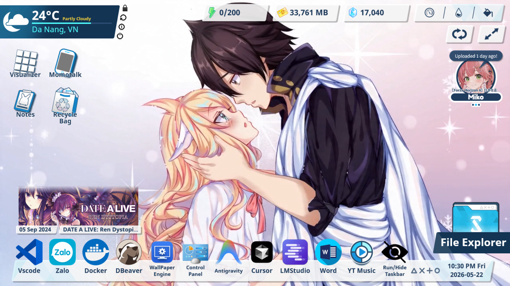
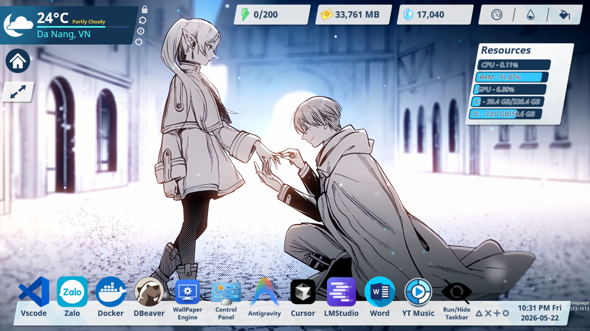
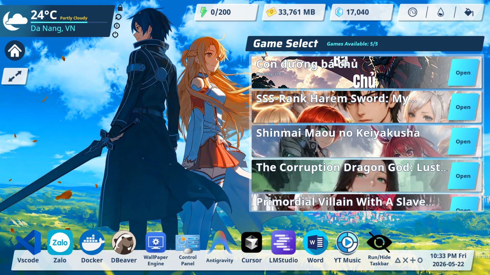
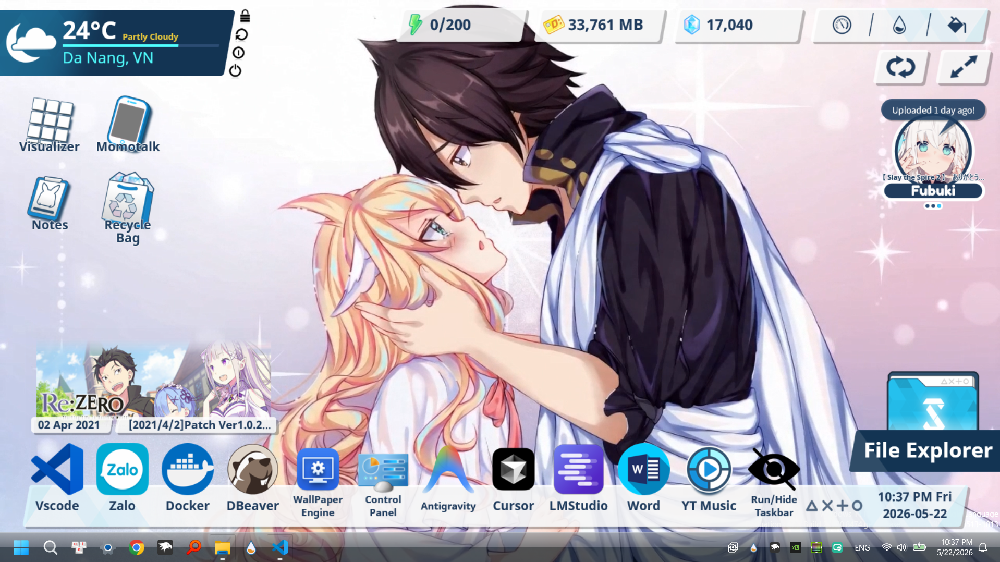
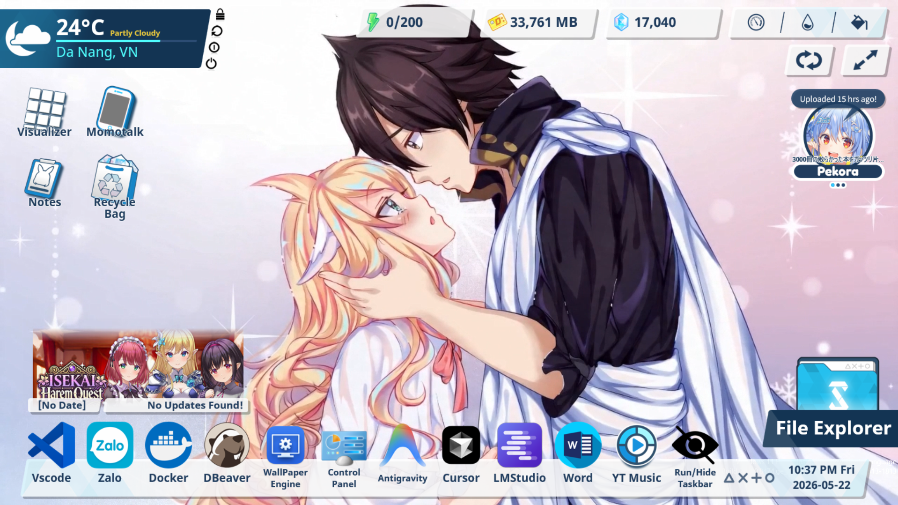

# Blue Archive Rainmeter Desktop UI

A customizable Rainmeter desktop setup inspired by Blue Archive.

<p align="center">
  
</p>

## Preview

<p align="center">
  
  
</p>

## Toggle — Hide Taskbar

| Before Hide Taskbar | After Hide Taskbar |
|---|---|
|  |  |

| Before Toggle | Before Toggle | After Toggle |
|---|---|---|
|  |  | |

| Main Layout Interaction | Hub Layout Interaction |
|---|---|
|  |  |

| Description |
|---|
| Right-click the **top-left corner** on the main layout to close the toggle.<br>Right-click the **top-right corner** on the hub layout to close the toggle.<br>Full desktop previews are shown above for comparison. |

## Features
- Blue Archive styled desktop interface
- Toggle hub system
- Dynamic layout switching
- Controller-based skin management
- Custom taskbar utilities
- Lightweight modular structure
- Personalized desktop workflow customization

## Requirements
- Windows 10 / 11
- Rainmeter 4.5+

## Installation
1. Clone or download this repository
2. Move the folder into:

```text
Documents\Rainmeter\Skins
```

3. Load the skins through Rainmeter

## Structure

```text
BlueArchive
├─ Controller
├─ ToggleSwitch
├─ ToggleSwitchHub
├─ RunAndHide
├─ mii power
└─ preview
```

## Credits
Base project:
https://github.com/Xenon257R/blue-archive-rainmeter

Original Rainmeter suite created by Xenon257R.

This repository contains my personal customization,
additional UI logic, automation systems,
hub behavior, and layout modifications.

## License
This project is based on an MIT licensed project.

Please refer to the LICENSE file for more information.